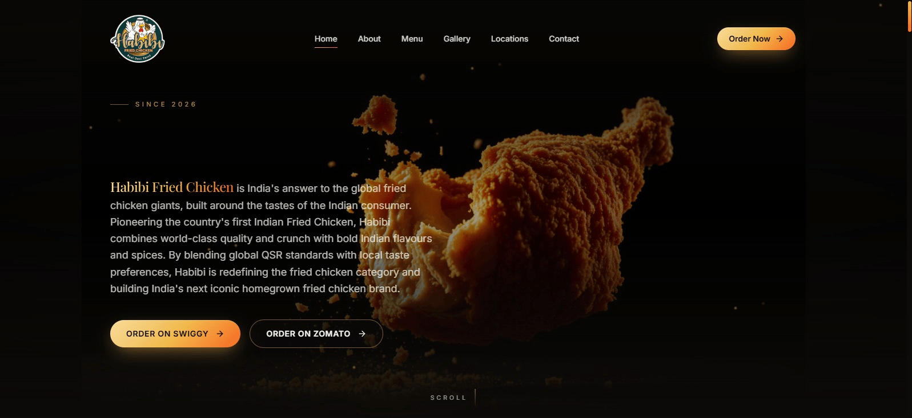

# 🍗 Habibi Craft

A modern, luxury-inspired restaurant landing page for **Habibi Fried Chicken**, designed to deliver a premium digital experience through immersive visuals, smooth animations, and responsive design.

The website showcases the brand story, signature menu, gallery, store locations, customer testimonials, and direct online ordering links, creating a seamless experience for visitors across all devices.

---

## ✨ Live Demo

> [https://your-vercel-url.vercel.app](https://habibi-craft.vercel.app/)

---

## 📸 Preview



---

## 🚀 Features

- 🎬 Cinematic hero section with immersive visuals
- 🍗 Premium brand storytelling ("Our Craft")
- 📖 Beautifully designed menu showcase
- 🖼️ Gallery highlighting signature dishes
- 📍 Multiple outlet locations with Google Maps integration
- 🛵 Direct ordering through Swiggy & Zomato
- ⭐ Customer testimonials
- 📱 Fully responsive across desktop, tablet and mobile
- ✨ Smooth animations and scroll transitions
- 🔍 SEO-friendly metadata and Open Graph support
- 🎨 Luxury-inspired UI with modern typography and glassmorphism effects

---

## 🏪 Store Locations

- Koramangala, Bengaluru
- HRBR Layout, Bengaluru
- Indiranagar (Cloud Kitchen)
- Sarjapur (Cloud Kitchen)

---

## 🛠 Tech Stack

### Frontend
- React
- TypeScript
- Vite
- TanStack Router

### Styling
- Tailwind CSS
- Custom CSS
- Glassmorphism UI

### Animation
- Framer Motion

### Tools
- Git
- GitHub
- Vercel

---

## 📂 Project Structure

```text
src/
├── assets/
├── components/
├── routes/
├── styles/
├── lib/
└── main.tsx
```

---

## ⚙️ Installation

Clone the repository

```bash
git clone https://github.com/yourusername/habibi-craft.git
```

Navigate into the project

```bash
cd habibi-craft
```

Install dependencies

```bash
npm install
```

Run the development server

```bash
npm run dev
```

Build for production

```bash
npm run build
```

Preview production build

```bash
npm run preview
```

---

## 🎯 Website Sections

- Home
- About / Our Craft
- Menu
- Gallery
- Locations
- Order Online
- Testimonials
- Contact
- Footer

---

## 🌟 Highlights

- Luxury restaurant-inspired interface
- Smooth page transitions
- Responsive layout
- High-performance Vite build
- Modern component-based architecture
- Clean and reusable React components

---

## 🔮 Future Improvements

- Online ordering system
- Shopping cart
- Reservation system
- Admin dashboard
- Customer authentication
- CMS integration
- Multi-language support

---

## 👨‍💻 Author

**Poli BhanuPrakash Reddy**

- GitHub: https://github.com/yourusername
- LinkedIn: https://linkedin.com/in/yourprofile

---

## 📄 License

This project is developed for portfolio and learning purposes.
